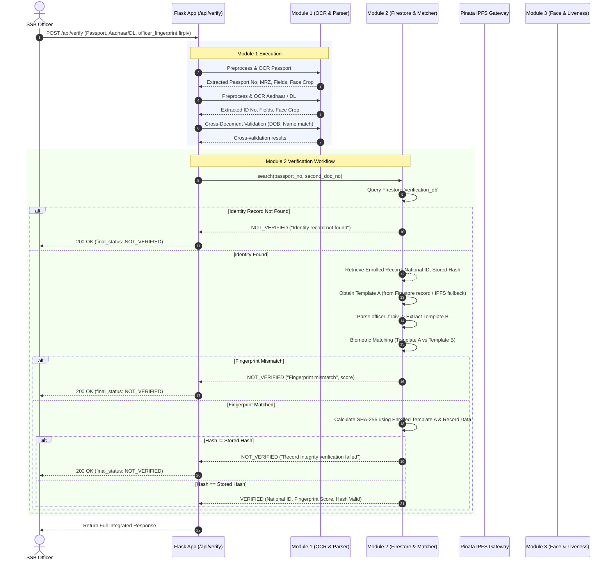

# V6 : Blockchain-Backed Multi-Layer Identity Verification & Forensic System

**TRUST-ID** is an enterprise-grade, multi-layer security and identity verification backend designed for authorized border control, law enforcement, and security personnel (such as SSB officers). It provides end-to-end verification of physical identity documents, cryptographic integrity checks against a trusted database, and dual-modality biometric validation (fingerprint and face with active liveness detection).

---

## Table of Contents

1. [Problem Statement](#1-problem-statement)
2. [Proposed Solution](#2-proposed-solution)
3. [System Architecture](#3-system-architecture)
   - [High-Level Architecture](#high-level-architecture)
   - [System Portals](#system-portals)
4. [Backend Flow & Verification Lifecycle](#4-backend-flow--verification-lifecycle)
   - [End-to-End Verification Pipeline](#end-to-end-verification-pipeline)
   - [Biometric Matching vs. Hash Integrity Verification](#biometric-matching-vs-hash-integrity-verification)
   - [Module 1 → Module 2 Data Hand-off](#module-1--module-2-data-hand-off)
5. [API Endpoints Reference](#5-api-endpoints-reference)
   - [Unified Document & Officer Verification (`POST /api/verify`)](#1-unified-verification-post-apiverify)
   - [Dedicated Identity & Fingerprint Verification (`POST /api/verify-identity`)](#2-dedicated-identity-verification-post-apiverify-identity)
   - [Trusted Identity Enrollment (`POST /api/enroll`)](#3-trusted-identity-enrollment-post-apienroll)
   - [Biometric Face Uploads (`POST /upload/*`)](#4-biometric-face-uploads-post-uploadpassport-post-uploadaadhaar-post-uploaddriving_license)
   - [Document Face Matching (`POST /match/passport-aadhaar`)](#5-document-face-matching-post-matchpassport-aadhaar)
   - [Active Liveness Blink Detection (`POST /blink/*`)](#6-active-liveness-blink-detection-post-blinkstart-post-blinkframe-post-blinkreset)
   - [Tri-Modal Biometric Identity Matching & Risk Scoring (`POST /match/identity`)](#7-tri-modal-identity-matching--risk-scoring-post-matchidentity)
   - [Utility Endpoints (`GET /faces/<filename>`, `GET /health`)](#8-utility-endpoints)
6. [Data Models & Storage Specifications](#6-data-models--storage-specifications)
   - [Firestore Collection: `verification_db`](#firestore-collection-verification_db)
   - [National ID Derivation Formula](#national-id-derivation-formula)
   - [Simulated Blockchain Hash Calculation](#simulated-blockchain-hash-calculation)
   - [FIRPIV & WSQ Biometric Processing](#firpiv--wsq-biometric-processing)
   - [Pinata IPFS Evidence Storage](#pinata-ipfs-evidence-storage)
7. [Security & Privacy Guardrails](#7-security--privacy-guardrails)
8. [Blockchain Roadmap (Future Phase)](#8-blockchain-roadmap-future-phase)
9. [Setup, Execution & Testing Guide](#9-setup-execution--testing-guide)

---

## 1. Problem Statement

In mission-critical identity checkpoints (e.g., border controls, sensitive government facilities), verifying identity based solely on physical documents or optical character recognition (OCR) is fundamentally vulnerable:

* **Sophisticated Document Tampering:** Attackers can forge physical documents or manipulate identity credentials by taking genuine document numbers belonging to legitimate citizens and fusing them with fraudulent photographs or altered biographical data.
* **Database Check Limitations:** Querying whether a Passport, Aadhaar, or Driving License number exists in an isolated government database verifies only that the *number* is valid—not that the *individual presenting it* is the genuine document holder.
* **Single-Factor Fragility:** Relying solely on documents, solely on fingerprints, or solely on facial recognition leaves systematic bypass vectors (e.g., silicone fingerprint spoofs, printed face masks, deepfakes, or altered document cards).

A robust forensic defense requires a **multi-layer zero-trust identity verification architecture** combining:
1. Physical document forensics, OCR extraction, and cross-document validation.
2. Cross-referencing against an immutable, cryptographically verifiable identity ledger.
3. Raw biometric fingerprint matching against enrolled records.
4. Facial biometrics coupled with hardware-level active liveness detection.
5. Continuous cryptographic tamper detection of all trusted records.

---

## 2. Proposed Solution

**TRUST-ID** solves this by enforcing a coordinated three-module verification pipeline:

* **Module 1 (Document OCR & Forensic Validation):** Extracts biographical fields, document numbers, MRZ codes, and structural validity from Passport, Aadhaar, and Driving License images, performing cross-document consistency checks.
* **Module 2 (Trusted Database, Fingerprint Biometrics & Blockchain Integrity):** Uses extracted document numbers to retrieve the canonical record in Firebase Firestore, verifies the officer's newly scanned `.firpiv` fingerprint against the enrolled template via in-memory WSQ feature matching, and recalculates the cryptographic record hash to detect database tampering.
* **Module 3 (Face Biometrics & Active Blink Liveness):** Performs facial extraction, deep-feature face comparison across identity documents using OpenCV SFace, and verifies physical presence via MediaPipe FaceMesh Eye Aspect Ratio (EAR) active blink detection.

---

## 3. System Architecture

### High-Level Architecture

```
                                  TRUST-ID SYSTEM
                                         |
                  +----------------------+----------------------+
                  |                      |                      |
                  v                      v                      v
              MODULE 1                MODULE 2               MODULE 3
        Document Validation     Identity DB & Fingerprint  Face & Liveness
                  |                      |                      |
        +---------+---------+  +---------+---------+  +---------+---------+
        | Preprocessing     |  | Firestore Ledger  |  | SFace Embedding   |
        | Tesseract OCR     |  | Pinata / IPFS     |  | MediaPipe FaceMesh|
        | MRZ & Parser      |  | WSQ / ORB Matcher |  | EAR Blink Engine  |
        | Cross-Check Logic |  | SHA-256 Integrity |  | Tri-Modal Risk Sc.|
        +---------+---------+  +---------+---------+  +---------+---------+
                  |                      |                      |
                  +-----------------> [CORE] <------------------+
                                         |
                                         v
                         FINAL OFFICER DECISION MATRIX
                      (VERIFIED / NOT_VERIFIED + Reason)
```

### System Portals

1. **SSB Officer Portal (Operational Verification):**
   - Uploads identity documents (Passport + Aadhaar / Driving License).
   - Captures/uploads the traveler's live fingerprint file (`.firpiv`).
   - Runs live webcam active blink verification.
   - Receives instant, unified multi-layer decisions (`VERIFIED` / `NOT_VERIFIED` with root-cause reason).
2. **Admin Portal (Enrollment & Credential Management):**
   - Ingests verified citizen identities.
   - Processes biometric enrollment packages (`.firpiv` → WSQ templates → IPFS pinning).
   - Generates deterministic National IDs and cryptographic integrity hashes.
   - Stores canonical records in Firestore.
3. **Forensic Investigator Portal (Audit & Evidence Inspection):**
   - Inspects raw IPFS-stored `.firpiv` audit trails.
   - Verifies integrity hashes against tamper events.
   - Evaluates biometric risk scores and multi-pair similarity matrices.

---

## 4. Backend Flow & Verification Lifecycle

### End-to-End Verification Pipeline



### Biometric Matching vs. Hash Integrity Verification

It is critical to distinguish between these two distinct operations:

| Dimension | Biometric Fingerprint Verification | Simulated Blockchain Hash Integrity |
|---|---|---|
| **Question Answered** | *"Does the person standing here own this enrolled identity?"* | *"Has the enrolled database record been illicitly modified or corrupted?"* |
| **Input A** | **Template A** (Retrieved from enrolled Firestore/IPFS record) | Canonical enrolled fields (`passport_no`, `national_id`, `Template A[:64]`) |
| **Input B** | **Template B** (Extracted from the officer's newly presented `.firpiv`) | Stored `hash` retrieved from Firestore |
| **Algorithm** | In-memory WSQ decode → OpenCV ORB keypoint extraction → Hamming BFMatcher with Lowe's ratio test | Canonical string formatting → SHA-256 hex digest comparison |
| **Security Rule** | **Never** use Template B to calculate the integrity hash. Only Template A reflects the trusted canonical record. |

### Module 1 → Module 2 Data Hand-off

* Module 1 runs full document parsing and outputs structured dictionaries.
* The extracted `passport_result["fields"]["passport_number"]` and `id_result["fields"]["aadhaar_number"]` (or `dl_number`) are forwarded in-memory directly to Module 2.
* **Module 2 never performs OCR.** It exclusively consumes verified, structured outputs from Module 1.

---

## 5. API Endpoints Reference

### 1. Unified Verification (`POST /api/verify`)

The primary integration endpoint used by the officer interface. Accepts document images and an optional officer fingerprint file.

* **URL:** `/api/verify`
* **Method:** `POST`
* **Content-Type:** `multipart/form-data`

#### Request Parameters
| Parameter | Type | Required | Description |
|---|---|---|---|
| `passport` | File | Yes | Scanned image of passport (JPEG/PNG). |
| `aadhaar` | File | Conditional | Scanned image of Aadhaar card (if verifying against Aadhaar). |
| `driving_license` | File | Conditional | Scanned image of Driving License (if verifying against DL). |
| `fingerprint_file` | File | Optional | Newly scanned officer fingerprint file (`.firpiv`). If omitted, returns Module 1 document validation only. |

#### Response: Successful Full Verification (HTTP 200)
```json
{
  "success": true,
  "verification": {
    "identity_found": true,
    "fingerprint_match": true,
    "hash_match": true,
    "final_status": "VERIFIED"
  },
  "identity": {
    "national_id": "9FBD41C1",
    "name": "Masilamani P"
  },
  "fingerprint": {
    "match": true,
    "score": 1.0
  },
  "integrity": {
    "hash_match": true
  },
  "passport": {
    "document_type": "passport",
    "fields": {
      "passport_number": "F8026100",
      "given_name": "MASILAMANI",
      "surname": "P",
      "date_of_birth": "1953-11-09",
      "nationality": "IND",
      "sex": "M"
    },
    "document_score": 92.5,
    "face": {
      "face_filename": "passport_face.jpg",
      "face_found": true,
      "quality_status": "PASS"
    }
  },
  "aadhaar": {
    "document_type": "aadhaar",
    "fields": {
      "aadhaar_number": "982203949168",
      "name": "MASILAMANI P",
      "date_of_birth": "1953-11-09",
      "gender": "MALE"
    },
    "document_score": 90.0,
    "face": {
      "face_filename": "aadhaar_face.jpg",
      "face_found": true,
      "quality_status": "PASS"
    }
  },
  "cross_document_validation": {
    "overall_status": "MATCH",
    "fields": {
      "name": { "status": "MATCH" },
      "date_of_birth": { "status": "MATCH" }
    }
  }
}
```

#### Response: Fingerprint Mismatch (HTTP 200)
```json
{
  "success": true,
  "verification": {
    "identity_found": true,
    "fingerprint_match": false,
    "hash_match": false,
    "final_status": "NOT_VERIFIED"
  },
  "reason": "Fingerprint mismatch",
  "identity": {
    "national_id": "9FBD41C1",
    "name": "Masilamani P"
  },
  "fingerprint": {
    "match": false,
    "score": 0.012
  }
}
```

#### Response: Record Integrity Failure / Tampering Detected (HTTP 200)
```json
{
  "success": true,
  "verification": {
    "identity_found": true,
    "fingerprint_match": true,
    "hash_match": false,
    "final_status": "NOT_VERIFIED"
  },
  "reason": "Record integrity verification failed",
  "identity": {
    "national_id": "9FBD41C1",
    "name": "Masilamani P"
  },
  "fingerprint": {
    "match": true,
    "score": 0.94
  },
  "integrity": {
    "hash_match": false
  }
}
```

#### Response: Identity Record Not Found (HTTP 200)
```json
{
  "success": true,
  "verification": {
    "identity_found": false,
    "fingerprint_match": false,
    "hash_match": false,
    "final_status": "NOT_VERIFIED"
  },
  "reason": "Identity record not found"
}
```

---

### 2. Dedicated Identity Verification (`POST /api/verify-identity`)

Direct Module 2 endpoint allowing an officer or backend service to verify identity using pre-extracted document numbers and a `.firpiv` file without re-uploading document image scans.

* **URL:** `/api/verify-identity`
* **Method:** `POST`
* **Content-Type:** `multipart/form-data`

#### Request Parameters
| Parameter | Type | Description |
|---|---|---|
| `passport_no` | Text | Enrolled passport number (e.g., `F8026100`). |
| `aadhaar_no` | Text | Enrolled Aadhaar number (e.g., `982203949168`) *[or `dl_no`]* |
| `dl_no` | Text | Enrolled Driving License number *[or `aadhaar_no`]* |
| `fingerprint_file`| File | New `.firpiv` file for biometric verification. |

#### Response (HTTP 200)
Returns standard Module 2 verification object (`verification`, `identity`, `fingerprint`, `integrity`).

---

### 3. Trusted Identity Enrollment (`POST /api/enroll`)

Used by the Admin Portal to enroll a verified citizen into the trusted database.

* **URL:** `/api/enroll`
* **Method:** `POST`
* **Content-Type:** `multipart/form-data`

#### Request Parameters
| Parameter | Type | Required | Description |
|---|---|---|---|
| `name` | Text | Yes | Full legal name. |
| `dob` | Text | Yes | Date of birth (`YYYY-MM-DD`). |
| `contact_no` | Text | Yes | Primary phone number. |
| `passport_no` | Text | Yes | Passport number. |
| `nationality`| Text | Yes | Nationality (e.g., `Indian`). |
| `documents` | Text | Yes | JSON string array: `[{"type": "aadhaar", "number": "982203949168"}]`. |
| `fingerprint_file` | File | Yes | Valid ISO/IEC 19794-4 `.firpiv` binary file. |

#### Response (HTTP 201 Created)
```json
{
  "success": true,
  "message": "Enrollment successful",
  "data": {
    "firebase_id": "lpvEPD1BBDuPYCReWcP2",
    "national_id": "9FBD41C1",
    "fingerprint": {
      "file_name": "a001.02_07.firpiv",
      "ipfs_cid": "QmUGeFMXUF8VafLPaYESxew4ndQXQrHuuAgn5BzHCLxdxL",
      "ipfs_url": "https://gateway.pinata.cloud/ipfs/QmUGeFMXUF8VafLPaYESxew4ndQXQrHuuAgn5BzHCLxdxL"
    },
    "hash": "3a2b099eaf7fd7a2f5b4291b17c19afaeaa198d3774a066eb4ad93968b008817"
  }
}
```

---

### 4. Biometric Face Uploads (`POST /upload/passport`, `POST /upload/aadhaar`, `POST /upload/driving_license`)

Extracts, validates quality, and caches document face crops for Module 3 matching.

* **Method:** `POST`
* **Body:** `passport` / `aadhaar` / `driving_license` image file.
* **Response (HTTP 200):**
```json
{
  "success": true,
  "type": "passport",
  "image_type": "passport_document",
  "face_found": true,
  "face_count": 1,
  "face_quality_score": 0.88,
  "quality_status": "PASS",
  "blur_score": 0.92,
  "face_filename": "passport_face.jpg",
  "message": "Face processed successfully."
}
```

---

### 5. Document Face Matching (`POST /match/passport-aadhaar`)

Compares extracted Passport face against Aadhaar/Driving License face using the OpenCV SFace ONNX deep feature model.

* **Method:** `POST`
* **Response (HTTP 200):**
```json
{
  "success": true,
  "passport_aadhaar": true,
  "id_type": "Aadhaar",
  "similarity": 0.8452,
  "threshold": 0.363,
  "decision": "MATCHED",
  "message": "Faces matched successfully."
}
```

---

### 6. Active Liveness Blink Detection (`POST /blink/*`)

Engineered for active anti-spoofing via webcam video frames.

* **`POST /blink/start`**: Initializes the real-time blink state machine.
* **`POST /blink/frame`**: Accepts `multipart/form-data` frame image (`frame`), calculates Left & Right Eye Aspect Ratio (EAR) via MediaPipe FaceMesh landmarks. Detects the natural biological transition: **OPEN → CLOSED (EAR < 0.21 for ≥2 frames) → OPEN**. Once satisfied, captures `live_face.jpg`.
* **`POST /blink/reset`**: Resets tracker states.

#### Frame Analysis Response (HTTP 200):
```json
{
  "success": true,
  "face_detected": true,
  "eye_state": "OPEN",
  "left_ear": 0.284,
  "right_ear": 0.291,
  "total_blinks": 1,
  "blink_detected": true,
  "live_face_captured": true,
  "message": "Blink verified successfully."
}
```

---

### 7. Tri-Modal Identity Matching & Risk Scoring (`POST /match/identity`)

Executes complete identity verification across all 3 biometric nodes:
1. `Passport Face ↔ Aadhaar/DL Face`
2. `Passport Face ↔ Live Webcam Face`
3. `Aadhaar/DL Face ↔ Live Webcam Face`

Computes composite forensic risk score (0–100 scale).

* **Method:** `POST`
* **Response (HTTP 200):**
```json
{
  "success": true,
  "overall_decision": "IDENTITY VERIFIED",
  "risk_level": "LOW",
  "risk_score": 17.41,
  "passport_aadhaar": { "decision": "MATCHED", "similarity": 0.8452, "threshold": 0.363 },
  "passport_live": { "decision": "MATCHED", "similarity": 0.5175, "threshold": 0.363 },
  "aadhaar_live": { "decision": "MATCHED", "similarity": 0.5175, "threshold": 0.363 },
  "liveness_status": "REAL",
  "document_face_quality": "GOOD",
  "risk_reasons": ["No significant Module 3 risk indicators detected."]
}
```

---

### 8. Utility Endpoints

* **`GET /faces/<filename>`**: Serves processed face images securely with cache-busting headers.
* **`GET /health`**: Healthcheck endpoint returning `{ "module": "TRUST-ID Module 3", "status": "running" }`.

---

## 6. Data Models & Storage Specifications

### Firestore Collection: `verification_db`

```json
{
  "name": "Masilamani P",
  "dob": "1953-11-09",
  "contact_no": "9597494353",
  "passport_no": "F8026100",
  "nationality": "Indian",
  "national_id": "9FBD41C1",
  "documents": [
    {
      "type": "aadhaar",
      "number": "982203949168"
    }
  ],
  "fingerprint_template": "2|<base64_wsq_finger1>|<base64_wsq_finger2>",
  "fingerprint_file": {
    "file_name": "a001.02_07.firpiv",
    "ipfs_cid": "QmUGeFMXUF8VafLPaYESxew4ndQXQrHuuAgn5BzHCLxdxL",
    "ipfs_url": "https://gateway.pinata.cloud/ipfs/QmUGeFMXUF8VafLPaYESxew4ndQXQrHuuAgn5BzHCLxdxL"
  },
  "created_at": "2026-09-15T09:20:20.633563+00:00",
  "hash": "3a2b099eaf7fd7a2f5b4291b17c19afaeaa198d3774a066eb4ad93968b008817"
}
```

### National ID Derivation Formula

A deterministic 8-character identifier derived strictly from government document numbers:

```python
CONSTANT = "TRUST-ID-V1"

if aadhaar and driving_license:
    raw = f"{aadhaar}|{driving_license}|{CONSTANT}"
elif aadhaar:
    raw = f"{aadhaar}|{CONSTANT}"
else:
    raw = f"{driving_license}|{CONSTANT}"

national_id = hashlib.sha256(raw.encode("utf-8")).hexdigest().upper()[:8]
```

### Simulated Blockchain Hash Calculation

Ensures complete tamper evidence over identity and biometric bindings:

```python
raw = (
    f"{data.get('passport_no', '')}|"
    f"{data.get('national_id', '')}|"
    f"{data.get('fingerprint_template', '')[:64]}"
)

record_hash = hashlib.sha256(raw.encode("utf-8")).hexdigest()
```

### FIRPIV & WSQ Biometric Processing

* **Specification:** ISO/IEC 19794-4 Finger Image Record (FIR) binary format.
* **Header:** Verified by finding magic byte offset `FIR\x00` with 36-byte general header.
* **Compression:** Enforces compression code `2` (Wavelet Scalar Quantization / WSQ).
* **Feature Extraction & Matching:**
  * Raw WSQ bytes are decoded in-memory via `PIL` and `wsq`.
  * Keypoints & 32-byte binary descriptors are computed via OpenCV ORB (`cv2.ORB_create(nfeatures=1000)`).
  * Descriptors matched using Hamming distance with Lowe's ratio test ($0.75$).
  * Threshold: Match declared when good matches $\ge 15$ or match ratio $\ge 0.15$.

### Pinata IPFS Evidence Storage

* Raw `.firpiv` binaries are never persisted directly into the relational/NoSQL document database.
* Uploaded to decentralized IPFS storage via Pinata REST API (`pinFileToIPFS`).
* The resulting CID and gateway URI are stored in Firestore for immutable forensic auditability.

---

## 7. Security & Privacy Guardrails

1. **Zero Raw Biometric Exposure:** API responses **never** return raw fingerprint templates, base64 WSQ streams, or biometric embeddings. Only booleans, confidence metrics, and matching scores are returned.
2. **Credential Isolation:** Pinata API keys, API secrets, and Firebase service account credentials reside strictly in `.env` and environment variables. Never returned through API error messages or logs.
3. **Memory-Only Processing:** WSQ image decoding and feature extraction occur entirely in memory buffers (`io.BytesIO`). Biometric binaries are not written to temporary public folders.
4. **Anti-Replay Verification:** Live blink detection requires dynamic real-time frame streams. Static photographs, video replays, or pre-recorded clips fail the EAR state transition threshold.

---

## 8. Blockchain Roadmap (Future Phase)

In the current prototype, database tamper protection is implemented via simulated SHA-256 canonical hashing. The planned production architecture transitions this into an immutable smart contract layer:

```
[Enrollment / Update]
        |
        v
Compute Canonical Hash
        |
        v
Ethereum / Polygon / Hyperledger Fabric Smart Contract
        |
        +---> storeRecord(nationalId, recordHash, ipfsCid, timestamp)
        |
[Verification Check]
        |
        v
Read on-chain recordHash by nationalId
        |
        v
Assert on-chain hash == recomputed Firestore record hash
```

This guarantees mathematical proof that neither a rogue administrator nor a compromised database server can tamper with citizen records without immediate forensic detection.

---

## 9. Setup, Execution & Testing Guide

### Prerequisites
* Python 3.12 (64-bit)
* Tesseract OCR installed on the host system

### Environment Configuration (`.env`)
Create a `.env` file in the root directory:
```env
PINATA_API_KEY=your_pinata_api_key
PINATA_SECRET_KEY=your_pinata_secret_key
FIREBASE_SERVICE_ACCOUNT=firebase/firebase-service-account.json
```

### Running the Server
```powershell
& "C:\Users\HP\AppData\Local\Programs\Python\Python312\python.exe" "app.py"
```
The server binds to `http://127.0.0.1:5000`.

### Postman Testing Recipes

#### 1. Full Verification Test (`POST /api/verify`)
* **Method:** `POST`
* **URL:** `http://127.0.0.1:5000/api/verify`
* **Body:** `form-data`
  * `passport`: Select passport image file (e.g. `uploads/module3/passport_ps.JPG`)
  * `aadhaar`: Select Aadhaar image file (e.g. `uploads/module3/aadhaar_ps.JPG`)
  * `fingerprint_file`: Select `.firpiv` file (e.g. `fp_temp/a001.02_07.firpiv`)

#### 2. Direct Identity Verification Test (`POST /api/verify-identity`)
* **Method:** `POST`
* **URL:** `http://127.0.0.1:5000/api/verify-identity`
* **Body:** `form-data`
  * `passport_no`: `F8026100`
  * `aadhaar_no`: `982203949168`
  * `fingerprint_file`: Select `fp_temp/a001.02_07.firpiv`

#### 3. Citizen Enrollment Test (`POST /api/enroll`)
* **Method:** `POST`
* **URL:** `http://127.0.0.1:5000/api/enroll`
* **Body:** `form-data`
  * `name`: `Sanjay M`
  * `dob`: `2005-12-15`
  * `contact_no`: `9876543210`
  * `passport_no`: `P1234567`
  * `nationality`: `Indian`
  * `documents`: `[{"type": "aadhaar", "number": "123456789012"}]`
  * `fingerprint_file`: Select `fp_temp/a001.02_07.firpiv`

#### 4. Passport Face Upload (`POST /upload/passport`)
* **Method:** `POST`
* **URL:** `http://127.0.0.1:5000/upload/passport`
* **Body:** `form-data`
  * `file`: Select a passport image (JPG/PNG)
* **Expected Response:**
```json
{
  "status": "success",
  "message": "Passport face extracted successfully",
  "face_path": "Module3/outputs/faces/passport_face.jpg"
}
```

#### 5. Aadhaar Face Upload (`POST /upload/aadhaar`)
* **Method:** `POST`
* **URL:** `http://127.0.0.1:5000/upload/aadhaar`
* **Body:** `form-data`
  * `file`: Select an Aadhaar card image (JPG/PNG)
* **Expected Response:**
```json
{
  "status": "success",
  "message": "Aadhaar face extracted successfully",
  "face_path": "Module3/outputs/faces/aadhaar_face.jpg"
}
```

#### 6. Start Liveness / Blink Detection (`POST /blink/start`)
* **Method:** `POST`
* **URL:** `http://127.0.0.1:5000/blink/start`
* **Body:** None (empty)
* **Expected Response:**
```json
{
  "status": "started",
  "message": "Blink detection session initialized. Stream frames to /blink/frame."
}
```

#### 7. Submit Live Frame (`POST /blink/frame`)
* **Method:** `POST`
* **URL:** `http://127.0.0.1:5000/blink/frame`
* **Body:** `form-data`
  * `frame`: Select a live webcam frame image (JPG/PNG)
* **Expected Response (blink not yet detected):**
```json
{ "status": "pending", "blink_detected": false, "ear": 0.31 }
```
* **Expected Response (blink confirmed):**
```json
{
  "status": "success",
  "blink_detected": true,
  "face_path": "Module3/outputs/faces/live_face.jpg"
}
```

#### 8. Passport–Aadhaar Face Match (`POST /match/passport-aadhaar`)
* **Method:** `POST`
* **URL:** `http://127.0.0.1:5000/match/passport-aadhaar`
* **Body:** None (uses internally saved face crops from Steps 4 & 5)
* **Expected Response:**
```json
{
  "status": "success",
  "match": true,
  "similarity_score": 0.87,
  "threshold": 0.363
}
```

#### 9. Full Tri-Modal Identity Match (`POST /match/identity`)
* **Method:** `POST`
* **URL:** `http://127.0.0.1:5000/match/identity`
* **Body:** None (uses passport, aadhaar, and live face crops saved from Steps 4, 5, and 7)
* **Expected Response:**
```json
{
  "status": "success",
  "passport_aadhaar_match": true,
  "passport_live_match": true,
  "aadhaar_live_match": true,
  "overall_match": true,
  "risk_score": 0.05,
  "verdict": "IDENTITY_CONFIRMED"
}
```

#### 10. Blink Session Reset (`POST /blink/reset`)
* **Method:** `POST`
* **URL:** `http://127.0.0.1:5000/blink/reset`
* **Body:** None
* **Expected Response:**
```json
{ "status": "reset", "message": "Blink detection session cleared." }
```

#### 11. Retrieve Saved Face Image (`GET /faces/<filename>`)
* **Method:** `GET`
* **URL:** `http://127.0.0.1:5000/faces/live_face.jpg`
* **Expected Response:** Raw JPEG image file (binary download)

---

### Negative / Edge Case Testing

These recipes validate the system's rejection behavior under fraud or mismatch conditions.

#### Case A — Identity Record Not Found (Wrong Passport Number)
* **Endpoint:** `POST /api/verify-identity`
* **Body:**
  * `passport_no`: `Z9999999` ← non-enrolled passport
  * `aadhaar_no`: `982203949168`
  * `fingerprint_file`: any `.firpiv`
* **Expected Response:**
```json
{
  "status": "NOT_VERIFIED",
  "reason": "Identity record not found for the provided documents.",
  "biometric_match": false
}
```

#### Case B — Wrong Fingerprint (Biometric Mismatch)
* **Endpoint:** `POST /api/verify-identity`
* **Body:**
  * `passport_no`: `F8026100` ← valid enrolled passport
  * `aadhaar_no`: `982203949168`
  * `fingerprint_file`: A `.firpiv` belonging to a **different** person
* **Expected Response:**
```json
{
  "status": "NOT_VERIFIED",
  "reason": "Biometric verification failed. Fingerprint does not match enrolled template.",
  "biometric_match": false,
  "match_score": 0.0
}
```

#### Case C — Hash Integrity Failure (Tampered Record)
* **Scenario:** Manually edit the `hash` field in Firestore `verification_db`, then re-run verification with the correct fingerprint.
* **Expected Response:**
```json
{
  "status": "NOT_VERIFIED",
  "reason": "Record integrity check failed. Hash mismatch detected — possible data tampering.",
  "biometric_match": true,
  "hash_match": false
}
```

#### Case D — Missing Fingerprint (Document-Only Fallback)
* **Endpoint:** `POST /api/verify`
* **Body:** passport + aadhaar images only, **no** `fingerprint_file`
* **Behavior:** System returns normal Module 1 OCR result. The `verification` key is absent — graceful fallback to document validation only, no error raised.

---

## 10. Project Directory Structure

```
V 6/
│
├── app.py                            ← Main Flask entry point; integrates all modules
├── .env                              ← API keys and service paths (not committed to VCS)
├── README.md                         ← This file
│
├── Module1/                          ← OCR & Document Validation
│   ├── services/
│   │   ├── document_parser.py        ← Dispatches OCR per document type (passport/aadhaar/DL)
│   │   ├── validation.py             ← Field extraction, cross-document validator
│   │   └── image_utils.py            ← Preprocessing (deskew, contrast enhance)
│   └── models/                       ← Trained OCR/layout models (if any)
│
├── Module2/                          ← Identity Enrollment & Fingerprint Verification
│   ├── routes/
│   │   └── enrollment.py             ← POST /api/enroll, POST /api/verify-identity
│   └── services/
│       ├── firebase_service.py       ← Firestore CRUD (create_enrollment, find_identity_by_documents)
│       ├── firpiv_service.py         ← ISO 19794-4 FIR binary parser → WSQ blocks
│       ├── pinata_service.py         ← Upload raw .firpiv to IPFS via Pinata
│       ├── matcher_service.py        ← ORB + BFMatcher WSQ fingerprint comparison
│       └── verification_service.py   ← 6-step verification orchestrator
│
├── Module3/                          ← Face Verification & Liveness Detection
│   ├── app.py                        ← Blueprint biometrics_bp; /upload, /blink, /match routes
│   ├── services/
│   │   ├── face_input.py             ← MediaPipe face crop extraction pipeline
│   │   ├── face_matcher.py           ← OpenCV SFace ONNX similarity scoring
│   │   └── blink_detector.py         ← EAR-based blink liveness detection
│   ├── models/
│   │   └── face_recognition_sface/   ← SFace .onnx model weights
│   └── outputs/
│       └── faces/                    ← Runtime face crops (passport_face.jpg, live_face.jpg …)
│
├── firebase/
│   └── firebase-service-account.json ← Firebase Admin SDK private key (never commit)
│
├── fp_temp/                          ← Sample .firpiv fingerprint files for local testing
│   └── a001.02_07.firpiv
│
├── templates/
│   └── index.html                    ← Single-page frontend (Verify / Enroll / Face Match tabs)
│
└── static/                           ← CSS / JS assets served by Flask (optional)
```

---

## 11. Technology Stack

| Layer | Technology | Purpose |
|---|---|---|
| **Runtime** | Python 3.12 (64-bit) | Core language |
| **Web Framework** | Flask 3.x | REST API server; Blueprint routing |
| **OCR Engine** | Tesseract OCR + `pytesseract` | Document text extraction (Module 1) |
| **Image Processing** | OpenCV (`cv2`) | Preprocessing, ORB feature detection, SFace ONNX inference |
| **Image Utilities** | Pillow (`PIL`) | Format conversion, resizing |
| **Face Detection** | MediaPipe FaceDetection | Real-time face localization from ID photos |
| **Face Recognition** | OpenCV SFace (ONNX) | 128-d face embedding + cosine similarity scoring |
| **Liveness Detection** | `dlib` / `scipy` | Eye Aspect Ratio (EAR) blink detection |
| **Fingerprint Parsing** | Custom `firpiv_service` | ISO 19794-4 FIR binary parser → WSQ blocks |
| **WSQ Decoding** | `wsq` library | Decode WSQ-compressed fingerprint images to NumPy arrays |
| **Biometric Matching** | OpenCV ORB + BFMatcher | Keypoint-based fingerprint template comparison |
| **Database** | Firebase Firestore | Enrolled identity records (`verification_db` collection) |
| **Firebase SDK** | `firebase-admin` | Server-side Firestore read/write |
| **IPFS Storage** | Pinata Cloud API | Decentralized storage of raw `.firpiv` files |
| **Cryptographic Hash** | `hashlib` SHA-256 | Canonical record integrity hash |
| **Environment Config** | `python-dotenv` | Load `.env` variables at startup |
| **HTTP Client** | `requests` | IPFS gateway fetch, Pinata upload |
| **Blockchain (Planned)** | Ethereum / Hyperledger | On-chain hash anchoring (future phase) |

---

## 12. Module Status Summary

| Module | Component | Status |
|---|---|---|
| **Module 1** | OCR — Passport parsing | ✅ Complete |
| **Module 1** | OCR — Aadhaar parsing | ✅ Complete |
| **Module 1** | OCR — Driving Licence parsing | ✅ Complete |
| **Module 1** | Cross-document field validation | ✅ Complete |
| **Module 2** | Citizen enrollment (`POST /api/enroll`) | ✅ Complete |
| **Module 2** | IPFS fingerprint upload (Pinata) | ✅ Complete |
| **Module 2** | Fingerprint template extraction (ISO 19794-4) | ✅ Complete |
| **Module 2** | Identity + fingerprint verification workflow | ✅ Complete |
| **Module 2** | Direct verification endpoint (`POST /api/verify-identity`) | ✅ Complete |
| **Module 2** | Hash integrity check (SHA-256 canonical) | ✅ Complete |
| **Module 3** | Passport / Aadhaar face extraction | ✅ Complete |
| **Module 3** | Live face capture + blink liveness | ✅ Complete |
| **Module 3** | Passport–Aadhaar face match | ✅ Complete |
| **Module 3** | Tri-modal identity match (`POST /match/identity`) | ✅ Complete |
| **Integration** | Module 1 + 2 + 3 unified in `app.py` | ✅ Complete |
| **Frontend** | Single-page UI (Verify / Enroll / Face Match tabs) | ✅ Complete |
| **Blockchain** | On-chain hash anchoring | 🔜 Planned |

---

## 13. Contributing & License

### Contributing

This is an academic/research prototype. Contributions are welcome for:
- Improving OCR accuracy for non-standard or damaged document layouts
- Adding support for additional document types (Voter ID, PAN Card, e-Passport chip)
- Integrating a production Ethereum smart contract for on-chain hash anchoring
- Replacing ORB-based fingerprint matching with a NIST-compliant SDK (e.g., SourceAFIS)

### Security Notice

> [!CAUTION]
> This system handles sensitive biometric and identity data. **Never deploy to a public-facing endpoint** without TLS (HTTPS), rate limiting, officer authentication (JWT/OAuth2), and audit logging. The current prototype is intended for **local/offline** testing environments only.

### License

This project is developed for educational and research purposes.

---

*TRUST-ID — Blockchain-Backed Multi-Layer Identity Verification & Forensic System*
*Backend documentation v1.0 — complete. Blockchain on-chain integration is the next phase.*
